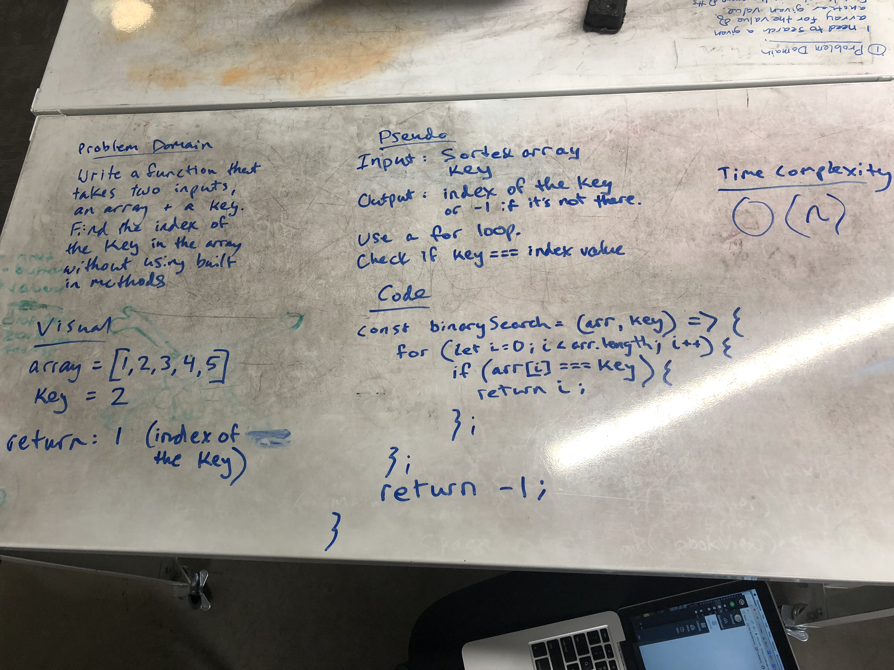

# Binary Search
This problem was originally given as an actual binary search problem, but then changed to a simple search. I solved it during the whiteboarding session as a simple search but then completed the binary search method later. 

## Challenge
Write a function called BinarySearch which takes in 2 parameters: a sorted array and the search key. Without utilizing any of the built-in methods available to your language, return the index of the array’s element that is equal to the search key, or -1 if the element does not exist.

## Solution

