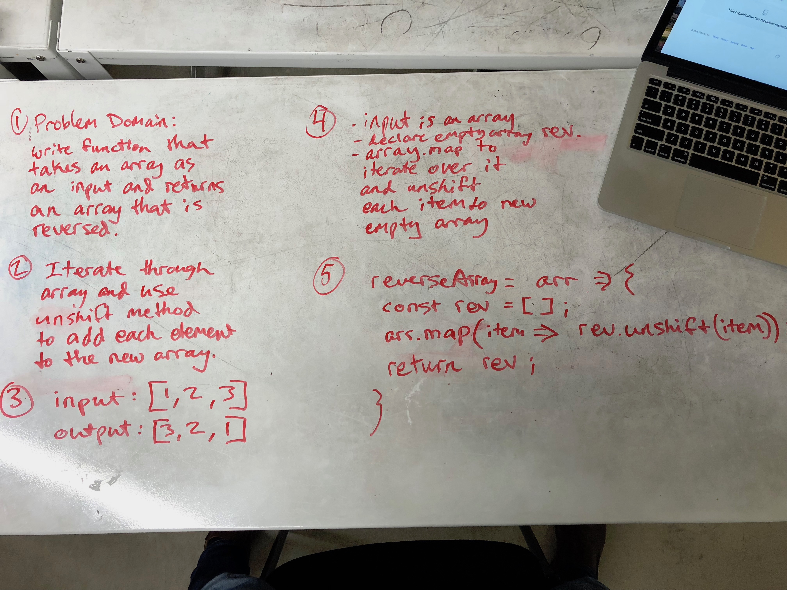

# Reverse an Array
First whiteboarding challenge for 401. 

## Challenge
Write a function called reverseArray which takes an array as an argument. Without utilizing any of the built-in methods available to your language, return the provided array argument with elements in reversed order.

## Solution

